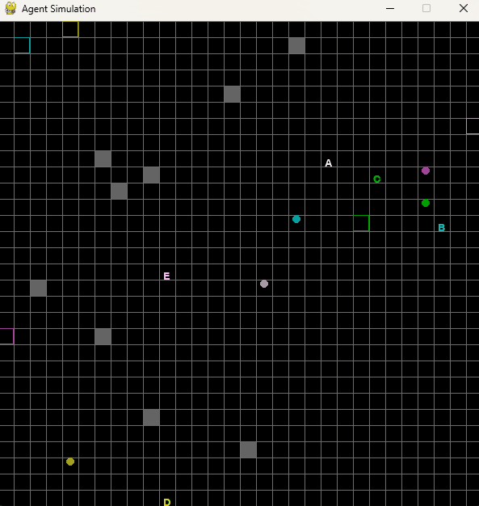

# Amazon Warehouse Simulation

Create a simulation of an Amazon Warehouse where robots have tasks to complete. Compare different heuristics as well as add the ability to run simulation for reinforcement learning.
